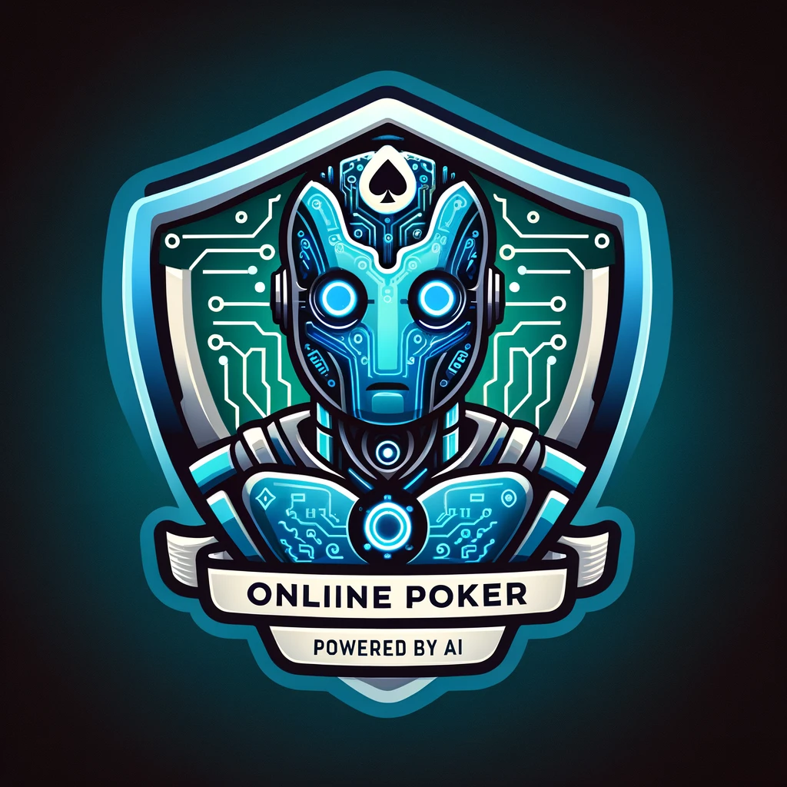

# PokerBot

  

## Overview
This project is designed to automate the process of analyzing poker game screenshots and providing recommendations on whether to fold or raise. It monitors a specified folder for new screenshots, analyzes the images using OpenAI's API, and logs the analysis results.

## Features
- **Screenshot Monitoring**: Automatically watches a specified folder for new screenshots.
- **Image Analysis**: Utilizes OpenAI's API to analyze poker game screenshots.
- **Decision Recommendations**: Provides recommendations based on the analysis of the current poker hand.

## Prerequisites

Before you begin, ensure you have met the following requirements:

- Node.js installed on your system.
- An OpenAI API key.

## Installation
1. Clone the repository.
2. Install dependencies: `npm install`.
3. Set up environment variables:
 - `OPENAI_API_KEY`
 - `MONITORED_FOLDER`
 - `PSEUDO`

## Usage
- To start the application, run: `node index.js`.

## Configuration
- Set Up Environment Variables: Create a .env file in the root directory and add your OpenAI API key.
- Specify the Monitored Folder: Change the monitoredFolder variable in the script to the path where your screenshots will be saved.

## License
PokerBot is [MIT licensed](LICENSE).